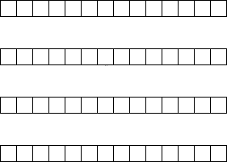

# Tendril



_Tendril_ is a MIDI Sequence Generator based on 1-D cellular automata. It can learn new cell update rules using a provided sequence of states in the form of an array or from a piece of music in `.midi` format.

## Usage

```bash
usage: main.py [-h] [--debug] [--png] [--json] [--midi] [--learn S]
               [--generateFrom R] [--seed S] [--scaleNum SN] [--scaleType ST]
               [--kernelRadius R] [--steps L] [--beatDuration D] [--outdir O]
               [--sampler F]

Learn cellular automata from sequences and generate new sequences.

optional arguments:
  -h, --help        show this help message and exit
  --debug           Enables additional logging and debug behavior.
  --png             Save PNG of the generated states.
  --json            Save JSON of the generated states.
  --midi            Save MIDI of the generated states.
  --learn S         Create a rule file from a sequence provided as JSON or
                    MIDI.
  --generateFrom R  Generate a new sequence from a provided JSON Rulefile.
  --seed S          Provide an array as a JSON file to be used as a seed
                    state.
  --scaleNum SN     Select scale 0-12
  --scaleType ST    Select scale type: [maj, min]
  --kernelRadius R  The radius of the kernel around the cell.
  --steps L         The number of total length in steps of the generated
                    sequence. (Default: 96)
  --beatDuration D  The total duration in ticks for each MIDI beat. (Default:
                    8)
  --outdir O        Output Directory: (default: '.')
  --sampler F       Choose the sampling function to apply to the resulting
                    cellular automaton sequence. (Options: ['noop',
                    'random_walk_sampler'])
```

## Examples

Here are a few examples generating sequences in C major (or `scale_num=0`)

### Learning The CA Rules of a MIDI file

```bash
python main.py \
    --learn examples/midi/chpn_op10_e01.midi
```

### Generate a New Tendril Sequence from a Seed and Rule File

```bash
python main.py \
    --generateFrom examples/rules/chopin_rules.json
    --seed examples/seeds/seed_32x1_1bit_active.json\
    --json\
    --midi\
    --png\
    --sampler=random_walk_sampler\
    --scaleNum=0
```

### Learning From A MIDI File and Generating a Sequence

The following command would run the entire end-to-end process using a kernel with neighborhood size of `7` (i.e. `kernel_radius * 2 + 1`):

```bash
python main.py \
    --seed examples/seeds/seed_32x1_1bit_active.json\
    --learn examples/midi/chpn_op10_e01.midi\
    --kernelRadius=3\
    --json\
    --midi\
    --png\
    --sampler=random_walk_sampler\
    --scaleNum=0
```

### Generate All Rules for a Given Rule Space

For a given `kernel_radius` (i.e. the neighborhood size of a cellular automata rule), all rules can be generated in one command.

```bash
python main.py \
    --generateAllRules examples/rules/eca_8bit \
    --kernelRadius=1
```
